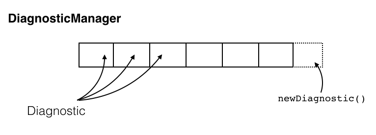

# Diagnostics

This page explains the Diagnostic module of PHARE.


# DiagnosticManager

The ```DiagnosticManager``` is the object that is charge of all diagnostics in the code. It is the interface the main code uses to manipulate diagnostics.




It basically offers two actions:

* ```compute()``` which computes all ```Diagnostics```
* ```save()``` which saves the ```Diagnostics``` to the disk.


Internally, the ```DiagnosticManager``` has:

* a container of all registered diagnostics
* an abstract ```ExportStrategy``` used to save data to any file format allowed in the code
* a ```DiagnosticScheduler``` that knows for each ```Diagnostic``` when to compute and when to write


# Diagnostic


## ```DiagPack``` are the data containers

The ```Diagnostic``` objects have to be written on disk at some point. Since ```ExportStrategy``` (see below) is totally ignorant of specific kinds of ```Diagnostic```, all data processed by Diagnostics have to be put in a standard form : the ```DiagPack```.
A ```DiagPack``` is simply :


```cpp
struct DiagPack
{
    std::unordered_map<std::string, std::vector<float>>  depends;
    std::unordered_map<std::string, std::vector<float>>  data;
    std::unordered_map<std::string, std::array<uint32,3>> nbrNodes;
};
```

which can contain any kind of data. Let's say we have a 3D Electric field. In this case, ```depends``` will contain three vectors for the coordinate ```x```, ```y```, ```z``` where the electric field is defined. ```data``` will be a linearized form of the 3D electric field array, not including ghost nodes. Finally ```nbrNodes``` will encapsulate the dimension of the field in the three directions. In case the diagnostic is a particle orbit, ```depends``` will contain the time, and ```data``` will contain 6 floats representing the particle position and velocity.


## What is a ```Diagnostic```?
A ```Diagnostic``` is an abstract interface that represents any diagnostic possible in the code. It is basically used by calling its methods ```compute()```. This method is in particular called by the ```DiagnosticManager::compute()``` in a loop over all ```Diagnostic```. The method will somehow get the data from PHARE internal data structures and put it in a standardized container that is later read by ```ExportStrategy``` to be written on disk.

There are different kinds of possible diagnostics, all present in the enum ```DiagType```. For each there is a concrete classe behind:

* ElectromagDiagnostic
* ParticleDIagnostic
* etc.


A diagnostic has a container of ```DiagPack``` objects.


# ExportStrategy

is an abstract class used by a ```DiagnosticManager``` to export a diagnostic to a file. Concrete implementations, unknown at the DiagnosticManager level, are, e.g., HDF5ExportStrategy, ASCIIExportStrategy, OpenPMDExportStrategy, etc. Note that each DiagnosticManager must implement the concrete ExportStrategy. In other words, if for example the user wantsHDF5 outputs, FieldDiagnosticManager must have its FieldHDF5ExportStrategy, and ParticleDIagnosticManager must have its ParticleHDF5ExportStrategy. This is because if writing an HDF5 file is generic, writing a field HDF5 file is different from writing a particle HDF5 file. The point of still having an abstract ExportStrategy is that


# DiagnosticScheduler

is an object in charge of activating DiagnosticManager objects at the appropriate time. It is the interface between the absolute time (available only at the main level) and the DiagnosticManagers. basically, a DiagnosticManager are registered into the DiagnosticScheduler at initialization. And the Scheduler, at each time, as a list of DiagnosticManager to activate.

```cpp
for (DiagnosticManager const& dm: dmAtTime_(t) )
{
    dm.activate(); // loops over its units, activate them, get the data and pass it to its concrete ExportStrategy
}
```


# use case

A user wants, say, E and B to be written at t= 12.1, 12.2 and 12.3 and write the results in a HDF5 file
A FieldDiagnosticManager will be created with E and B diag fields (builder pattern ?)
The FieldDagnosticManager is registered at in lists of DiagnosticManager at each of the appropriate times in the DiagnosticScheduler
The FieldDiagnosticManager creates Npatch FieldDiagnosticUnits, one per patch.
The ExportStrategy of the FieldDiagnosticManager is set to be a HDF5ExportStrategy

time integration begins
at each time, the DiagnosticScheduler loops over the list of DiagnosticManagers registered at that time. For each of them, it calls DiagnosticManager::activate(), which itself will loop over the DiagnosticUnits and activate them. Each unit will do its computation (if any) and return a const ref to the result (ex. no calculation + return Field const&  on ions::rho_, or calculation of divB(x,y,z) and return Field const& on that buffer). Once all the DiagnosticUnits have returned, the results are passed to the concrete ExportStrategy which writes them to a file.


draft :


